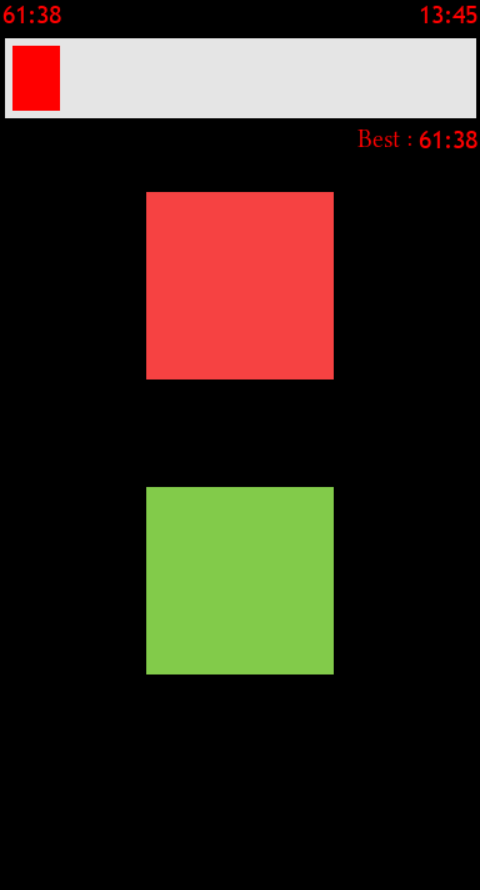
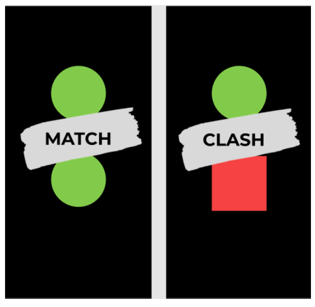
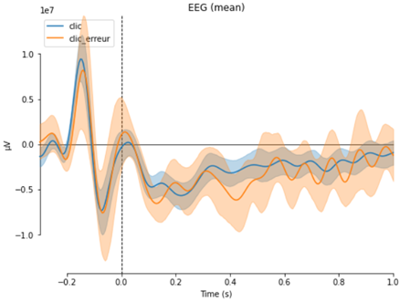
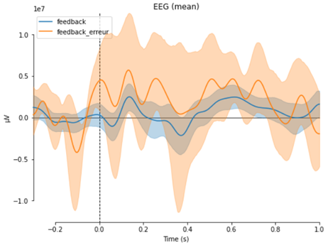

# Analyse des Potentiels d'erreur et Potentiels Evoqués Visuels Stationnaires sur des signaux EEG

Le code présenté ici comprend:
* des interfaces utilisées lors d'expérience pour la détection des Potentiels d'erreur (ErrP) et Potentiels Evoqués Visuels Stationnaires (SSVEP)
* des protocoles réseaux entre les interfaces, la carte EEG OpenBCI Ganglion ainsi qu'une carte son Scarlett
* des bibliographies
* des analyses de résultat

## Jeu Speed Images

  

- **Principe du jeu:** les joueurs doivent dire si les composants affichés sont strictement identiques ou non
- **Objectif de l’expérience**: detection des ErrP dans le lobe frontal du joueur quand le joueur fait des erreurs ou que le jeu ne réagit pas correctement (introduction de bugs aléatoires)
- **Outils utilisés:**
    - Pour le développement: Python (PyGame, Numpy, PyAudio)
    - Pour le captage des données: OpenBCI Ganglion et l’interface d’OpenBCI avec l’aide d’une Carte Son pour générer des signaux propres aux événements
    - Pour le traitement des données: Python
- **Interface:**
    - 2 formes s’affichent toutes les 3 secondes et le joueur doit indiquer si elles sont identiques (match) ou différentes (clash) (la probabilité d’avoir des composants identiques est de 30%). Un feedback direct du clic du joueur s’affiche sur l’écran
    - Une barre de score au-dessus permet de stimuler le joueur
    - Toutes les 3 secondes, un message apparaît sur l’écran afin de dire au joueur s’il a réussi (BRAVO) ou perdu (DOMMAGE)

  

- **Resultats**
    - Nous observons une baisse de l’amplitude sur les électrodes Fz et Cz lors des mauvais clic du joueur

  

    - Nous observons une grande variation de l’amplitude des électrodes Fz et Cz lors de mauvais feedbacks de l’interface

  

